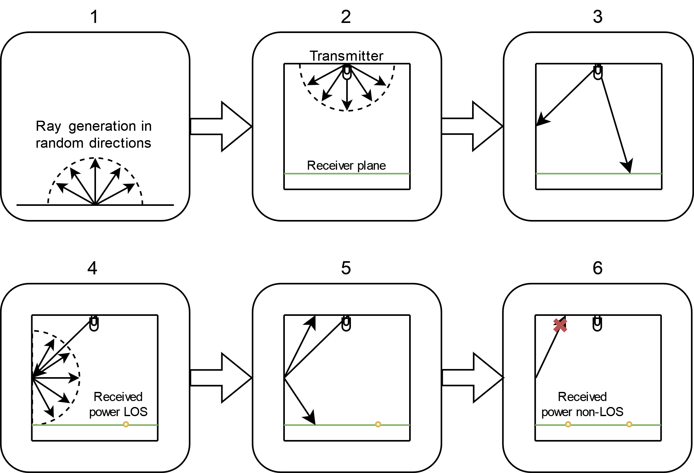

# Visible Light Communication Simulation Using Raytracing Method
A Python-based visible light communication simulator using ray tracing methods.

## Description

Visible Light Communication (VLC) uses LED light to transmit data while also illuminating a space. To analyze VLC performance in complex indoor environments, accurate simulation tools are important. This Python-based simulator uses a Monte Carlo ray-tracing method to model how light distributes across different room shapes.

The simulator works by loading a 3D model of the room (in STL format) and simulating light emission from LEDs. This helps users understand how room geometry and materials impact VLC system performance. The tool is open-source, making it accessible for VLC research and development.

The following diagram illustrates the basic steps of the simulation process:



## Requirements

Python 3 with the packages `numpy`, `numpy-stl`, and `matplotlib`.

You can easily install the required packages using this command:

```sh
pip install -r requirements.txt
```

This simulator was tested with Python 3.12 but should work with any recent Python 3 version.

## Usage

To run a simulation, you need a 3D file that represents the room in STL format. Ensure that the normals of the mesh are correctly oriented.

Next, create objects representing the emitter and receiver. These objects can then be passed to the VLC simulator object to perform a simulation and retrieve the results.

Here is an example code snippet:

```python
# Emitter parameters
h = 2.15  
theta = 70
power = 200

# Receiver parameters
angle = 60
area = 0.016
index = 1.5

# Room parameters
rho = 0.8

# Load geometry, "square_room" is the name of the STL file representing the geometry located in the resource folder
triangles = load_triangles_from_file("square_room", rho)

# Create objects
emitter = Emitter(np.array([0, 0, h]), np.array([0, 0, -1]), power, theta)
receiver = Receiver(0, angle, area, index, (-2.5, 2.5, -2.5, 2.5))
simulation = VLCSimulator([emitter], receiver, triangles)

# Perform the simulation
X, Y, mean_power, nlos_mean_power = simulation.do_simulation(1000, 100, 100, 25)

# Display the results
plot_surface(X, Y, 10 * np.log10(mean_power + nlos_mean_power))

```

This code runs a simulation with a single emitter in an L-shaped room, showing the power distribution received on the floor.

Result : 


